# Scaling Neuro

Scaling Neuro is a privacy-first path from a scanner export to a reusable functional-MRI archive. The `0.3.0` beta is deliberately narrow: a researcher points one terminal command at a completed DICOM folder; `neuro-sync` selects confidently identified functional EPI, rewrites it locally under a default-deny DICOM de-identification policy, uploads resumable per-series archives to Cloudflare R2, and returns a durable receipt. Pinned conversion and scientific validation then run asynchronously on the Sophont cluster.

It is open to any lab. Registration records the lab and creates a revocable identity for one workstation; the same lab may register any number of workstations. Scaling Neuro is a research transfer system, not a clinical device or a substitute for consent, IRB, or data-use review.

## Researcher experience

Install one executable—no Python, Docker, AWS CLI, Cloudflare key, local converter, browser, or administrator access:

```sh
# macOS or Linux
curl -fsSL https://scalingneuro.com/install.sh | sh
```

```powershell
# Windows PowerShell
irm https://scalingneuro.com/install.ps1 | iex
```

The installer returns to the shell. After finding the export path, run:

```sh
neuro-sync /path/to/dicom-export
```

On first use, registration and the authorization confirmation happen in that terminal. During discovery, privacy rewriting, archive creation, and transfer, the client shows bytes, speed, percentage, and ETA. Once R2 confirms the exact object length and multipart receipt, the workstation is done; cluster processing does not keep it connected.

If the process or network stops, rerun the identical folder command. The folder selects the compatible local checkpoint automatically, so completed archives and multipart parts are reused. There is no separate `resume` command.

## What is preserved

The canonical ingest object is one deterministic `dicom.tar.zst` per accepted functional-EPI series. It contains newly written DICOM Part 10 instances plus a canonical manifest. The source directory is read-only and unchanged.

For each uploaded instance, `neuro-sync`:

- copies Pixel Data byte-for-byte in the original transfer syntax;
- recursively rewrites nested sequences, not only the top-level header;
- replaces patient identity and all referential UIDs with consistent site-scoped pseudonyms;
- removes calendar dates/times, administrative/clinical identifiers, institutions, stations, operators, descriptions, comments, overlays, graphics, unknown private data, and unsafe private text or binary values;
- preserves a conservative scientific allowlist covering pixel decoding, geometry, timing, MR acquisition, scanner make/model/software, coils, acceleration, and referenced-image structure; and
- reopens and audits the result before it can enter an upload archive.

The archive manifest records pseudonymous subject/session/series/protocol identities, classifier evidence, policy/version provenance, an ordered instance inventory, and SHA-256 hashes. It never contains source paths, filenames, source UIDs, or free-text descriptions.

This is not a claim that unchanged scanner DICOM is anonymous. The executable behavior is documented in [the DICOM de-identification policy](docs/dicom-deidentification-policy.md), informed by DICOM PS3.15. Unsupported privacy conditions fail closed.

Structural MRI, diffusion, ASL, field maps, SBRefs, localizers, derived images, and ambiguous series stay local. Structural scans remain out of scope until a separate validated face-privacy path exists.

## Functional-EPI selection

Selection is evidence-based, with a separate exact vendor/export compatibility gate. An accepted series must be MR, original/primary, satisfy the active burned-in-annotation policy, and have strong EPI plus temporal/functional evidence. Exclusion evidence wins over inclusion evidence. The threshold is intentionally high (`>= 0.90`), and uncertain data is held locally with a code-only reason.

The current measured support boundary is deliberately narrower than “all DICOM.” Classic Siemens mosaic from the tested Prisma/E11 family is accepted only when its CSA image header can be parsed and rebuilt from a seven-field numeric/vector allowlist. Classic Philips from the tested 5.1.1 family is accepted, including its reviewed PS3.15 private scaling fields, only when any dynamic-timing metadata satisfies a strict whole-series contract. GE classic, every Enhanced MR object, extended-offset-table objects, and unverified scanner/export families are held locally with stable compatibility codes. A fixture claim requires a recursive privacy audit, exact pixel and conversion-equivalence checks, and an end-to-end receipt; one validated fixture does not imply every scanner or software release from that vendor.

## Architecture

```mermaid
flowchart LR
  A["neuro-sync folder"] --> B["Discover and classify EPI"]
  B --> C["Rewrite and audit DICOM locally"]
  C --> D["Deterministic series archive"]
  D --> E["Checksum-bound resumable upload"]
  E --> F["Durable R2 receipt"]
  F --> G["D1 processing queue"]
  G --> H["Sophont Slurm consumer"]
  H --> I["Pinned dcm2niix and scientific QC"]
  I --> J["Derived NIfTI, sidecar, processing manifest"]
```



The client never receives a reusable R2 credential. The Worker creates a multipart object and issues a short-lived `UploadPart` URL bound to an exact key, multipart ID, part number, content length, and SHA-256 header. Returned ETags are checkpointed locally. Completion performs only multipart completion plus authoritative R2 `HEAD`; it does not read gigabytes through a Worker request.

Receipt and scientific processing are separate states. A successful upload means the locally privacy-cleared DICOM archive is durable and queued. A cluster consumer later receives scoped GET/PUT capabilities, verifies the whole archive and every member, repeats the privacy and purpose audit, runs pinned `dcm2niix`, validates a native-space 4D functional NIfTI and minimized sidecar, publishes deterministic derived outputs, and commits the catalog under a lease. A stale processor cannot publish after losing that lease. A terminal server finding that the input violates the privacy, archive-boundary, or functional-EPI contract deletes that source object and leaves an auditable tombstone; converter or scientific-compatibility failures retain the de-identified source for review.

Stable site/project/series-archive identity makes creation and completion idempotent. Raw series archives may be up to 64 GiB; larger folders are transparently divided into receipt sessions of at most eight series and 250 GiB so multipart finalization stays within Cloudflare's strictest request limits. This is invisible to the researcher and does not change archive identity. If two authenticated devices in the same managed site/project upload the same eligible series concurrently, the exact winner is reused and the losing prefix is purged; a semantic mismatch or withdrawal tombstone is never treated as a duplicate success. Open self-service workstation registrations are intentionally independent privacy domains, so any number of machines from one lab can register without sharing pseudonym keys or trusting self-asserted lab names. Public workstations have no cumulative upload allowance; bounded receipt sessions, object sizes, and multipart requests remain enforced as operational safety limits.

## Command line

```sh
# Normal path; first use registers in the terminal.
neuro-sync /path/to/dicom-export

# Optional explicit setup for managed workstations.
neuro-sync register --email researcher@example.edu --name "Researcher Name" \
  --institution "Example University" --lab "Example Neuroimaging Lab" --accept-policy

# Explicit form and non-interactive authorization.
neuro-sync upload /path/to/dicom-export
neuro-sync upload /path/to/dicom-export --confirm-authorized

# Classify, rewrite, audit, and archive locally without contacting the service.
neuro-sync upload /path/to/dicom-export --dry-run

neuro-sync status --json
neuro-sync report RUN_ID --json
```

Running `neuro-sync` without arguments remains a guided terminal fallback. `neuro-sync run` remains an alias for `upload`. Reports contain only pseudonymous identifiers, counts, hashes, and stable status/QC codes—never local paths or arbitrary DICOM values.

## Repository

| Path | Role |
|---|---|
| `client/` | Rust terminal client: registration, DICOM selection/rewrite, deterministic archive, checkpoints, progress/ETA, multipart upload |
| `worker/` | Cloudflare control plane: D1 state, R2 receipt, idempotency, queue leases, scoped processor capabilities |
| `worker/migrations/` | Ordered production D1 migrations and legacy-upload backfill |
| `processor/` | Pinned cluster consumer, DICOM/archive validation, conversion, derived-artifact validation, Slurm/Enroot deployment |
| `schemas/` | Versioned public request, artifact, status, and error contracts |
| `docs/` | De-identification, ingest, onboarding, API, release, and vendor-QA contracts |
| `installers/` | Dependency-free terminal installer templates |
| `scripts/` | Installer rendering/tests and explicit Pages build allowlist |
| `.github/workflows/` | Client, Worker, processor, schema, release, migration, and deployment gates |

## Local verification

Requirements are Rust 1.85, Node.js 22, and Python 3.13.

```sh
python3 -m pip install --requirement schemas/requirements.txt
python3 schemas/validate.py
node schemas/validate-ajv.mjs

npm ci --prefix worker
npm run check --prefix worker

cargo +1.85.0 fmt --manifest-path client/Cargo.toml --all -- --check
cargo +1.85.0 clippy --locked --manifest-path client/Cargo.toml --all-targets --all-features -- -D warnings
cargo +1.85.0 test --locked --manifest-path client/Cargo.toml --all-features
python3 -m pip install --require-hashes -r scripts/vendor-dicom-qa-requirements.txt
python3 scripts/test_vendor_dicom_qa.py
python3 scripts/vendor_dicom_qa.py --self-test

python3 -m venv processor/.venv
processor/.venv/bin/pip install --require-hashes -r processor/requirements.lock
PYTHONPATH=processor processor/.venv/bin/python -m unittest discover -v -s processor/tests

./scripts/test-installers.sh
./scripts/build-site.sh
node --check dist/_worker.js
```

Never place participant scans or populated secret files in this repository. DICOM/NIfTI data, `.env*`, `.dev.vars`, processor work directories, build output, and local Cloudflare state are ignored.

## Production

Production is published as one source-aligned unit. A `main` push deploys only when the latest non-prerelease client tag points to that exact commit and its version matches the client source. A new release stays a private GitHub draft while the workflow builds every platform package and applies migrations. It then deploys the new Worker/site with byte-for-byte verified copies of the currently public downloads, proves that exact preserved client can still register, proves the newly built candidate client and non-PHI fixture through production and Sophont, and only afterward cuts over the new index, installers, and packages. Any post-deploy failure rolls Pages back to the production deployment captured before phase one; only a fully verified release is made public. Production requires D1 `DB`, R2 `ARCHIVE`, and these secrets:

- `ADMIN_API_TOKEN`
- `SITE_KEY_ENCRYPTION_KEY_B64`
- `R2_PARENT_SECRET_ACCESS_KEY`
- `PROCESSOR_API_TOKEN`

Before either release path deploys, the production gate compares the Pages dashboard with the exact D1 database ID, R2 bucket, R2 account/access-key IDs, and TTL values committed in `worker/wrangler.jsonc`; it also requires all four secrets to remain encrypted and preview deployments to have no production bindings. CI exercises both acceptance and fail-closed mismatch cases. The tracked hourly cleanup workflow calls the authenticated admin route so expired, withdrawn, and rejected temporary inputs continue to be purged even though Pages itself has no Cron Trigger.

The R2 parent token must be dedicated to Object Read & Write on only the Scaling Neuro bucket. The processor token is stored separately as a mode-`0600` file on shared Sophont storage; it receives only short-lived object-scoped capabilities. See [processor/README.md](processor/README.md) for the pinned container and bottom-priority Slurm deployment.

Client packages are built from the current `main` commit for universal macOS, Windows x64, and one fully static Linux x64 target with no distribution-library choice. Each is a single client executable plus licenses, release metadata, and SBOMs. Ordinary CI and the release workflow verify the executable and static Linux linkage; release gates also verify signing state, package hash, installer behavior, tamper rejection, and protected Windows private-state ACLs. See [the release contract](docs/client-release.md).

## Remaining broad-adoption gates

- Maintain the pinned public Siemens/Philips compatibility harness as a release gate, and expand the privacy-audited matrix across additional models, software releases, PACS rewrites, and transfer syntaxes.
- Add the proven narrow GE classic metadata reconstruction only after hostile/property tests demonstrate that no opaque private block or unbounded value can enter an archive.
- Validate Enhanced MR shared/per-frame semantics and exact extended-offset-table pairing before enabling either route.
- Run clean-machine installation, interruption, automatic continuation, and receipt tests on each promised OS and representative institution-managed workstations.
- Independently inspect every release’s stored rewritten DICOM, derived sidecar/manifest, metadata retention, PHI absence, native geometry, hashes, withdrawal, and cleanup.
- Add governed discovery/access, compatibility dashboards, and downstream training caches without weakening the immutable source archive.
- Keep structural MRI on a separate route until local defacing and quantitative brain-preservation QC are validated.

## Contracts

- [EPI ingest and identity](docs/epi-ingestion-contract.md)
- [DICOM de-identification](docs/dicom-deidentification-policy.md)
- [Artifacts and APIs](docs/artifact-and-api-contracts.md)
- [Terminal onboarding](docs/collaborator-onboarding.md)
- [Client release](docs/client-release.md)
- [Vendor QA](docs/vendor-qa.md)
- [Scaling Neuro initiative brief](Scaling%20Up%20Neuroimaging%20Data%20for%20Foundation%20Models.md)
- [Web-scale archive strategy](Creating%20web-scale%20neuroimaging%20database.md)

## License

Scaling Neuro is available under either [Apache License 2.0](LICENSE-APACHE) or [MIT](LICENSE-MIT). Server-side third-party components retain their own notices.
