# Scaling Neuro

Scaling Neuro is a privacy-first ingestion path for building a scientifically usable, acquisition-space functional MRI archive. The current `0.2.0` open beta is a working EPI-only system: a researcher registers their lab once, opens `neuro-sync`, chooses a folder of newly exported DICOMs, and lets the client classify, convert, quality-check, resume, and commit eligible scans to Cloudflare R2.

This is no longer a static workflow mockup. The repository contains the cross-platform Rust client, Cloudflare control plane, D1 migrations, R2 multipart transport, strict public schemas, release automation, and the Scaling Neuro site. Self-service registration is open to any lab; the tool is not a clinical device or a substitute for IRB, consent, or data-use review.

## Researcher experience

1. Download the package for macOS, Windows, or Linux from [scalingneuro.com/downloads](https://scalingneuro.com/downloads/), then extract the whole bundle.
2. Open `neuro-sync` with no arguments. It launches a loopback-only interface and the operating system’s native folder picker.
3. Complete the one-minute lab form, review the contribution policy, and confirm that the selected scans are institutionally approved. If the response is lost, reopening with the same details safely recovers the same client-bound registration instead of creating duplicates.
4. Choose the top-level DICOM export folder and click **Validate and upload**.
5. Leave the client running. If the network drops or the app closes, reopen it and choose **Resume**; completed work is checkpointed locally.

Researchers do not install Python, Docker, FSL, an AWS CLI, or Cloudflare credentials. Release bundles include the pinned multi-vendor `dcm2niix v1.0.20260416` converter under `libexec/`.

Registration creates a private, revocable upload identity for a workstation and lab. It is not evidence of participant consent and cannot authorize an otherwise impermissible upload.

## What the pilot archives

The canonical unit is one confidently identified functional EPI time series:

- a deterministic `.nii.gz` in native acquisition space, with voxel values, scaling, affine, and sampling preserved; and
- a same-basename JSON sidecar containing only allowlisted acquisition metadata, conversion provenance, classifier evidence, QC codes, and cryptographic hashes.

The client retains useful scanner and acquisition context such as manufacturer/model/software, field strength and coils, sequence codes, TR/TE/flip angle/slice timing, phase encoding and readout timing, acceleration factors, matrices, voxel sizes, affine/orientation, volume count, datatype, and converter provenance. The executable policy is [schemas/metadata-policy-v1.json](schemas/metadata-policy-v1.json); everything not named there is dropped.

Source DICOMs remain read-only and local. The pilot does not upload raw headers, DICOM UIDs, names, MRNs, accession numbers, source dates/times, institution/station/device identifiers, operator fields, protocol/series free text, private tags, source paths, or filenames. Structural MRI, DWI, ASL, fieldmaps, SBRefs, localizers, secondary captures, derived scans, and ambiguous series stay local. Structural ingestion and local defacing/refacing are deliberately deferred to a separate fail-closed route.

Acceptance is vendor-neutral and evidence-based. An uploaded scan must be MR, original/primary functional EPI, exactly 4D, at least 10 volumes, have plausible TR/TE and geometry, contain finite non-constant signal, pass privacy gates, and achieve classifier confidence of at least `0.90`. Unsupported or uncertain data is held locally with code-only reasons rather than guessed into the archive.

See [the full EPI ingestion contract](docs/epi-ingestion-contract.md) and [artifact/API contracts](docs/artifact-and-api-contracts.md).

## Architecture

```mermaid
flowchart LR
  A["Researcher selects DICOM folder"] --> B["Local discovery and EPI classification"]
  B --> C["Pinned dcm2niix conversion"]
  C --> D["Header scrubbing, metadata allowlist, and QC"]
  D --> E["Native-space NIfTI plus sidecar"]
  E --> F["Worker-created multipart plan"]
  F --> G["One short-lived signed URL per exact part"]
  G --> H["Cloudflare R2 canonical archive"]
  F --> I["D1 control plane and audit state"]
  H --> J["Server-side byte verification and immutable manifest"]
  J --> I
```



The client never receives a reusable R2 access key. The Worker creates each multipart upload, then signs a 15-minute `UploadPart` URL bound to one full key, multipart ID, part number, byte length, and SHA-256 header. Parts upload sequentially and returned ETags are checkpointed in local SQLite. The Worker alone completes/aborts objects, reads the stored bytes back through SHA-256, validates the sidecar again, and writes a canonical immutable manifest.

One Worker upload session contains one pseudonymous subject, at most 32 bundles/32 GiB, with a 5 GiB compressed-NIfTI ceiling. The client deterministically splits larger or multi-subject folders into sequential sessions. Pseudonymous subject/session/series/protocol/bundle IDs are 96-bit site-scoped HMACs; raw HMAC inputs never cross the API.

Scientific identity uses the uncompressed NIfTI SHA-256, not a multipart ETag or gzip representation. Stable `(site_id, project_id, bundle_id)` identity supports deduplication and withdrawal tombstones, while compressed hashes and sidecar hashes remain transport-integrity evidence. Derived training representations belong in a separate cache and never replace this canonical archive.

## Command line

The GUI and CLI use the same local state and resume machinery.

```bash
# Register once. The default server is https://scalingneuro.com.
neuro-sync register --email researcher@example.edu --name "Researcher Name" \
  --institution "Example University" --lab "Example Neuroimaging Lab"

# Validate, convert, and upload one exported folder.
neuro-sync upload /path/to/dicom-export

# Run the complete local privacy/QC path without contacting the API or R2.
neuro-sync upload /path/to/dicom-export --dry-run

# Resume all unfinished runs, or one local run ID.
neuro-sync resume
neuro-sync resume RUN_ID

neuro-sync status --json
neuro-sync report RUN_ID --json
```

`neuro-sync run` remains an alias for `upload`. Running `neuro-sync` without a subcommand opens the local graphical flow. Reports contain pseudonyms, counts, stable codes, hashes, and archive commit IDs—not raw DICOM values or local paths.

## Repository layout

| Path | Role |
|---|---|
| `client/` | Rust 1.85 desktop/CLI client, local SQLite checkpoints, DICOM classification, conversion, QC, and multipart uploader |
| `worker/` | TypeScript Cloudflare Worker/Pages entrypoint, D1 control plane, R2 lifecycle, admin APIs, and scheduled cleanup |
| `worker/migrations/` | Ordered D1 schema and concurrency/catalog migrations |
| `schemas/` | Draft 2020-12 enrollment, local-preparation, sidecar, upload, part-URL, archive-manifest, status/error, and metadata-policy contracts plus examples |
| `docs/` | Ingestion, onboarding, API, and release contracts |
| `downloads/` | Collaborator-facing release page; versioned artifacts are generated by the release workflow |
| `scripts/build-site.sh` | Explicit production allowlist and Pages Worker build |
| `.github/workflows/ci.yml` | Schema, Rust, and Worker verification |
| `.github/workflows/release-client.yml` | Cross-platform packages, converter verification, signing/notarization, SBOMs, checksums, and pilot publication |
| `.github/workflows/deploy-production.yml` | D1 migration gate and Cloudflare Pages production deployment |
| `index.html`, `styles.css`, `app.js` | Public Scaling Neuro research site and illustrative scan explorer |

## Development and verification

Requirements are Node.js 22, Rust 1.85 with `rustfmt`/`clippy`, and Python 3.13 for schema validation.

```bash
npm ci --prefix worker
python3 -m pip install --requirement schemas/requirements.txt

python3 schemas/validate.py
node schemas/validate-ajv.mjs
npm run typecheck --prefix worker
npm test --prefix worker

cargo +1.85.0 fmt --manifest-path client/Cargo.toml --all -- --check
cargo +1.85.0 clippy --locked --manifest-path client/Cargo.toml --all-targets --all-features -- -D warnings
cargo +1.85.0 test --locked --manifest-path client/Cargo.toml --all-features

./scripts/build-site.sh
node --check dist/_worker.js
```

The Worker tests exercise lost-response enrollment replay, invite exhaustion, strict request parsing, multipart allocation, part signing, authoritative post-completion HEAD verification, manifest/schema validity, idempotency, withdrawal/tombstones, cleanup, and hostile cases using local Cloudflare bindings. The Rust suite includes owner-only pending enrollment recovery, resume-context binding, synthetic Part 10 DICOM discovery/classification, and a full offline conversion/scrubbing/bundling dry run.

### Local Worker and registration

```bash
cp worker/.dev.vars.example worker/.dev.vars
# Fill the local-only secrets in worker/.dev.vars.

npm run db:migrate:local --prefix worker
npm run dev --prefix worker
```

Then register a source build against the local API:

```bash
cargo run --manifest-path client/Cargo.toml -- \
  register --email researcher@example.edu --name Researcher \
  --institution University --lab Neuroimaging \
  --server http://127.0.0.1:8787
```

An unenrolled offline dry run is also supported. Point the client at the exact pinned converter when running from source:

```bash
NEURO_SYNC_DCM2NIIX=/absolute/path/to/dcm2niix \
  cargo run --manifest-path client/Cargo.toml -- \
  upload /path/to/dicom-export --dry-run
```

Never place real participant scans or populated secret files in the repository. DICOM/NIfTI inputs, `.env*`, `.dev.vars`, build outputs, and local Cloudflare state are ignored.

## Administration

The admin API lists public registrations, revokes devices, withdraws uploads, and retains invite administration for private named projects. Use the bundled wrapper rather than hand-writing requests:

```bash
SCALING_NEURO_API_URL=https://scalingneuro.com \
ADMIN_API_TOKEN='...' \
npm run admin --prefix worker -- registrations

SCALING_NEURO_API_URL=https://scalingneuro.com \
ADMIN_API_TOKEN='...' \
npm run admin --prefix worker -- invite \
  --site-slug princeton \
  --site-name 'Princeton Neuroscience Institute' \
  --project-slug epi-pilot \
  --project-name 'EPI Pilot' \
  --consent-policy-version pilot-1 \
  --expires-seconds 604800 \
  --max-uses 1

SCALING_NEURO_API_URL=https://scalingneuro.com \
ADMIN_API_TOKEN='...' \
npm run admin --prefix worker -- revoke-device --id DEVICE_UUID
```

Device tokens and private invite codes are shown only when issued; D1 stores hashes. Site pseudonym keys and public-registration email addresses are encrypted with the production site-key encryption secret.

## Deployment and releases

Every push to `main` runs the migration gate, builds the explicit site/schema/docs allowlist and Pages Worker, and deploys the `scalingneuro` Cloudflare Pages project. Production requires GitHub Actions secrets `CLOUDFLARE_API_TOKEN` and `CLOUDFLARE_ACCOUNT_ID`, plus correctly configured Pages bindings for D1 (`DB`) and R2 (`ARCHIVE`) and runtime secrets:

- `ADMIN_API_TOKEN`
- `SITE_KEY_ENCRYPTION_KEY_B64`
- `R2_PARENT_SECRET_ACCESS_KEY`

The non-secret R2 account/access-key IDs, bucket, TTLs, and service version are defined in `worker/wrangler.jsonc`. The parent R2 token must be dedicated to Object Read & Write on only the Scaling Neuro bucket; it never leaves the Worker.

Client packages are produced by `.github/workflows/release-client.yml` from the current `main` commit. It builds Linux x86_64, Windows x86_64, and universal Intel/Apple-silicon macOS artifacts; verifies official converter archive hashes; emits SPDX/CycloneDX SBOMs, `latest.json`, and `SHA256SUMS`; and enforces the Cloudflare Pages 25 MiB per-file limit. Suffix-free macOS artifacts require both Developer ID signing and accepted Apple notarization. Restricted builds are visibly named `CODESIGNED-PILOT` or `UNSIGNED-PILOT`.

See [docs/client-release.md](docs/client-release.md) for signing/notarization secrets and the release checklist.

## Pilot limitations and production gates

The implementation is deliberately honest about what remains before broad academic rollout:

- Scanner support comes from dcm2niix plus fail-closed validation, not a claim that every historical or malformed export works. Build a PHI-free compatibility matrix across Siemens classic/enhanced/XA, Philips classic/enhanced, and GE classic/enhanced exports.
- Complete clean-machine smoke tests on each promised OS, including native folder selection, interruption/resume, commit, report, and operating-system trust prompts.
- Run at least one institution-approved fresh scanner export end to end and independently inspect the stored sidecar/manifest, metadata retention, PHI absence, native affine/voxel hashes, withdrawal, and cleanup.
- Keep the R2 live smoke in the release gate. The deployed implementation has completed an ordinary-client Siemens fixture upload, independently reproduced the compressed/uncompressed/sidecar/manifest hashes after R2 download, and rejected wrong-part, expired, wrong-hash, and wrong same-length payloads. Repeat that evidence for every release and each named collaborator environment.
- Before any non-public participant data, rotate the current production signer credential and independently verify that the replacement is dedicated to Scaling Neuro with Object Read & Write access to only its archive bucket. The current credential has not yet been verified as dedicated and bucket-scoped; the successful transport smoke does not establish that permission boundary.
- Configure Apple notarization and Windows Authenticode secrets for low-friction collaborator packages; unsigned artifacts remain named pilot builds.
- Keep the checksum-verified release restoration gate healthy. Ordinary production deploys now restore the exact asset inventory from the newest non-draft `client-v*` release, verify `SHA256SUMS` and `latest.json`, reject unsafe or oversized assets, and only then publish the downloads.
- Structural MRI remains out of scope until a separate local face-privacy pipeline, quantitative brain-preservation QC, and fail-closed review path are implemented.
- The current archive/control plane is ingestion-first. Dataset search, governed access/export, compatibility dashboards, and derived training caches are later Scaling Neuro surfaces, not reasons to weaken the canonical archive now.

## Scientific and privacy contracts

- [EPI ingestion, classifier, metadata, QC, identity, and archive invariants](docs/epi-ingestion-contract.md)
- [Versioned artifact and HTTP API contracts](docs/artifact-and-api-contracts.md)
- [One-folder collaborator onboarding](docs/collaborator-onboarding.md)
- [Cross-platform release process](docs/client-release.md)
- [Vendor fixture and production QA evidence](docs/vendor-qa.md)
- [Initiative brief](Scaling%20Up%20Neuroimaging%20Data%20for%20Foundation%20Models.md)
- [Expanded database strategy note](Creating%20a%20web-scale%20neuroimaging%20database.md)

## License

Scaling Neuro is available under either the [Apache License 2.0](LICENSE-APACHE) or the [MIT License](LICENSE-MIT), at your option. Bundled third-party components retain their own notices.
